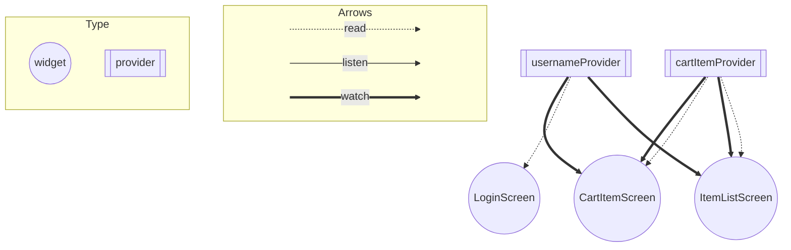

# hooks_riverpod_sample

hooks_riverpodのサンプル実装

thank you riverpod_graph.  
https://github.com/rrousselGit/riverpod/tree/master/packages/riverpod_graph

```mermaid
flowchart TB
  subgraph Arrows
    direction LR
    start1[ ] -..->|read| stop1[ ]
    style start1 height:0px;
    style stop1 height:0px;
    start2[ ] --->|listen| stop2[ ]
    style start2 height:0px;
    style stop2 height:0px; 
    start3[ ] ===>|watch| stop3[ ]
    style start3 height:0px;
    style stop3 height:0px; 
  end

  subgraph Type
    direction TB
    ConsumerWidget((widget));
    Provider[[provider]];
  end
  CartItemScreen((CartItemScreen));
  usernameProvider ==> CartItemScreen;
  cartItemProvider ==> CartItemScreen;
  cartItemProvider -.-> CartItemScreen;
  LoginScreen((LoginScreen));
  usernameProvider -.-> LoginScreen;
  ItemListScreen((ItemListScreen));
  usernameProvider ==> ItemListScreen;
  cartItemProvider ==> ItemListScreen;
  cartItemProvider -.-> ItemListScreen;
  usernameProvider[[usernameProvider]];
  cartItemProvider[[cartItemProvider]];
```
